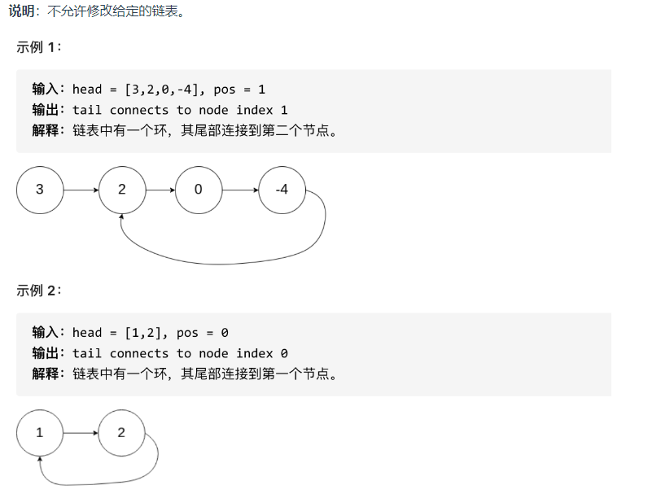

# topic

### 双指针：

142.环形链表II

题意： 给定一个链表，返回链表开始入环的第一个节点。 如果链表无环，则返回 null。
为了表示给定链表中的环，使用整数 pos 来表示链表尾连接到链表中的位置（索引从 0 开始）。 如果 pos 是 -1，则在该链表中没有环。


15.三数之和

给你一个整数数组 nums ，判断是否存在三元组 [nums[i], nums[j], nums[k]] 满足 i != j、i != k 且 j != k ，同时还满足 nums[i] +
nums[j] + nums[k] == 0 。请

你返回所有和为 0 且不重复的三元组。

注意：答案中不可以包含重复的三元组。

> 示例 1：

```输入：nums = [-1,0,1,2,-1,-4]
输出：[[-1,-1,2],[-1,0,1]]
解释：
nums[0] + nums[1] + nums[2] = (-1) + 0 + 1 = 0 。
nums[1] + nums[2] + nums[4] = 0 + 1 + (-1) = 0 。
nums[0] + nums[3] + nums[4] = (-1) + 2 + (-1) = 0 。
不同的三元组是 [-1,0,1] 和 [-1,-1,2] 。
注意，输出的顺序和三元组的顺序并不重要。
```

> 示例 2：

 ```
 输入：nums = [0,1,1]
 输出：[]
 解释：唯一可能的三元组和不为 0 。
```

> 示例 3：

```
输入：nums = [0,0,0]
输出：[[0,0,0]]
解释：唯一可能的三元组和为 0 。
```